## Introduction

Probo is a blockchain-based framework for secure, privacy-preserving document verification across borders. The system stores cryptographic proofs instead of raw document data, enabling real-time authentication without exposing sensitive information or requiring centralized authorities.

Originally designed to combat sophisticated travel document forgery, Probo's generic architecture supports any multi-party verification scenario including academic credentials and professional certifications.

## Design

### Storing Issuance Proof

The proof storage process follows these steps:

1. **Data Encryption**: Document data is encrypted using the issuing entity's public key through a dApp interface ***(performed in dApp)***
2. **Digital Signature**: The encrypted data hash is signed with the issuing entity's private key ***(performed in dApp)***
3. **Blockchain Storage**: The signed message is stored on the blockchain via extrinsics, along with:
   - The issuing entity's public key
   - Expiration block number

### Verifying Proof

The verification process enables secure document authentication:

1. **Data Collection**: The verifying entity receives necessary data and the signed message hash from the user in person
2. **Public Key Retrieval**: The entity retrieves the issuing entity's public key from the blockchain using the signed message hash
3. **Hash Reconstruction**: The data hash is reconstructed using the retrieved public key ***(performed in dApp)***
4. **Signature Decryption**: The signed message is decrypted using the public key ***(performed in dApp)***
5. **Hash Verification**: The system confirms authenticity by checking that the decrypted hash matches the reconstructed hash ***(performed in dApp)***

### Diagram

```mermaid
flowchart TB
    subgraph STORE ["🔒 Storing Issuance Proof"]
        direction LR
        A[Document Data] --> B[Encrypt with Public Key<br/>***dApp***]
        B --> C[Generate Hash]
        C --> D[Sign Hash with Private Key<br/>***dApp***]
        D --> E[Store on Blockchain<br/>+ Signature Hash<br/>+ Public Key<br/>+ Expiration Block]
    end

    subgraph VERIFY ["🔍 Verification Process"]
        direction LR
        F[User Presents Data<br/>+ Signature Hash] --> G[Retrieve Public Key<br/>from Blockchain]
        G --> H[Reconstruct Data Hash<br/>***dApp***]
        H --> I[Decrypt Signed Message<br/>***dApp***]
        I --> J[Verify Hash Match<br/>***dApp***]
        J --> K{Hashes Match?}
        K -->|Yes| L[Document Verified ✓]
        K -->|No| M[Verification Failed ✗]
    end

    %% Connection between processes
    STORE --> VERIFY

    %% Styling
    classDef dappProcess fill:#e1f5fe,stroke:#0277bd,stroke-width:2px
    classDef blockchain fill:#f3e5f5,stroke:#7b1fa2,stroke-width:2px
    classDef decision fill:#fff3e0,stroke:#f57c00,stroke-width:2px
    classDef success fill:#e8f5e8,stroke:#388e3c,stroke-width:2px
    classDef failure fill:#ffebee,stroke:#d32f2f,stroke-width:2px

    class B,D,H,I,J dappProcess
    class E,G blockchain
    class K decision
    class L success
    class M failure
```

## Background
Inceasing number of travel document forgery (i.e. visa, passport etc.) results in illegal entry to nations and costly verification process for immigration departments.

Advances in counterfeiting technology make forged documents increasingly difficult to detect visually, requiring time-consuming verification processes and specialized equipment to authenticate travel documents.

Additionally, travel document information is not shared with transit countries before travelers arrive. Transit countries lack digital reference systems to efficiently verify document authenticity. National security concerns prevent countries from sharing travel document issuance information with other nations.

## Attack Vector Analysis

This section presents a systematic analysis of a sophisticated document forgery attack that exploits the current limitations in cross-border travel document verification systems.

### Attack Methodology

The attack follows a multi-stage process wherein malicious actors exploit authentic visa materials to create fraudulent travel documents:

1. **Initial Document Acquisition**: The embassy of Country A, located in Country B, issues legitimate visas to travelers i, j, and k. These visas incorporate state-of-the-art anti-counterfeiting technologies in adhesive sticker format.

2. **Physical Document Manipulation**: Sophisticated actors employ advanced techniques to extract authentic visa stickers from the original passports with minimal material damage, preserving the integrity of the security features.

3. **Identity Substitution**: The extracted authentic visas undergo photo replacement procedures, where the original traveler photographs are substituted with images of unauthorized individuals (travelers x, y, and z).

4. **Document Reassembly**: The modified visas are subsequently affixed to the passports of travelers x, y, and z, creating composite fraudulent documents that combine authentic visa materials with unauthorized bearer identities.

### System Vulnerabilities Exploited

The attack leverages several critical vulnerabilities in the current international travel verification infrastructure:

- **Information Asymmetry**: Transit Country C operates without real-time access to Country A's visa issuance database, creating verification blind spots.
- **Detection Complexity**: The fraudulent documents resist visual inspection due to the authentic nature of the underlying visa materials and security features.
- **Resource-Intensive Verification**: Authentication requires specialized equipment and trained personnel, creating bottlenecks in high-volume immigration checkpoints processing hundreds of thousands of travelers daily.
- **Temporal Verification Gaps**: The detection of fraud occurs only after Country A identifies discrepancies and alerts transit authorities, by which time the perpetrators may have already gained unauthorized access.

### Critical Security Implications

This attack vector demonstrates a fundamental weakness where the authenticity of individual document components (genuine visa materials) does not guarantee the legitimacy of the composite document (passport-visa combination). The security breach occurs not through counterfeiting of security features, but through the unauthorized recombination of authentic materials with fraudulent identity credentials.

### Diagram

## Proposed Solution

To address the identified vulnerabilities in cross-border document verification systems, we propose a blockchain-based cryptographic proof framework that enables secure, privacy-preserving verification of composite document authenticity.

### Core Architecture

Our proposed system implements a distributed ledger solution that facilitates inter-entity verification of document issuance without compromising sensitive information. Rather than storing individual document details, the system generates and stores cryptographic proofs that attest to the legitimate combination of multiple document components.

The framework operates on composite document hashing and digital signatures, where the cryptographic proof is derived from the combination of:
- Primary document identifier (e.g., visa number)
- Bearer document identifier (e.g., passport number)
- Issuing entity identifier
- Temporal issuance metadata

**Digital Signature Process:**
1. **Data Encryption & Hash Generation**: The issuing entity first encrypts each individual document attribute (visa number, passport number, issuing entity ID, etc.) using their own public key, then combines these encrypted values and processes them through cryptographic hash functions with collision-resistant properties
2. **Signature Creation**: The entity signs this hash using their private key through a dapp interface, creating a digital signature (proof)
3. **Blockchain Storage**: Only the signed proof, the entity's public key, and validation temporal data are stored on the blockchain - not the original document data
4. **Verification Process**: When document verification is required, the validating entity follows these steps:
   - Encrypts each received document attribute (visa number, passport number, etc.) using the issuing entity's public key
   - Combines the encrypted values and reconstructs the document hash
   - Retrieves the issuing entity's public key from the blockchain using the stored signature
   - Decrypts the signature with the public key to extract the original signed hash
   - Confirms document authenticity by verifying that both hashes match
   - Validates the proof's temporal metadata stored on the blockchain to ensure the document remains valid and has not expired

This cryptographic approach follows established public key cryptography principles, such as the RSA digital signature scheme (Rivest, Shamir, and Adleman, 1977), ensuring that verification can occur without exposing sensitive document details while maintaining mathematical proof of authenticity.

### Privacy-Preserving Design

The system addresses critical national security concerns through information minimization principles. Only cryptographic proofs are stored on the blockchain, ensuring that:
- Raw document data remains within issuing authorities
- Statistical inference about issuance volumes is computationally infeasible
- Cross-border intelligence gathering through blockchain analysis is prevented
- Verification occurs without exposing sensitive bilateral relationships

### Generalized Framework Applications

The proposed architecture extends beyond travel document verification to encompass any multi-party document authentication scenario. The framework's generic design enables deployment across diverse use cases requiring composite document verification.

**Academic Credential Verification Case Study**: Consider a scenario where University P in Country A issues a bachelor's degree to a recipient who subsequently seeks authentication through a two-step verification process:

**Step 1 - Department of Education Verification**: Country A's Department of Education validates the university credential and creates a blockchain proof incorporating:
- University identifier hash and degree certificate hash
- Recipient's identity document hash
- Department of Education authentication signature

**Step 2 - Embassy Validation**: Country B's embassy verifies the Department of Education's proof and creates an additional blockchain proof that includes:
- Reference to the Department of Education's blockchain proof
- Embassy validation signature

Upon the recipient's arrival in Country B, local authorities can cryptographically verify both proofs sequentially: first confirming the Department of Education's authentication, then validating the embassy's endorsement. This dual-verification approach provides enhanced security through multiple institutional validations while eliminating the need for direct institutional communication.

## Justification

### Why Traditional Web2 Solutions Are Insufficient

**Trust and Centralization Issues**: Web2 solutions require a central authority or intermediary to facilitate document verification between countries. This creates several critical problems:
- **Single Point of Failure**: A centralized system becomes vulnerable to attacks, data breaches, and system outages that could compromise global travel security
- **Trust Dependencies**: Countries must trust a third-party organization with sensitive immigration data, which conflicts with national sovereignty and security policies
- **Political Vulnerabilities**: Geopolitical tensions could lead to service disruptions or data weaponization by the controlling entity

**Data Privacy and Sovereignty Concerns**: Traditional database systems require storing sensitive document information in centralized servers:
- **Information Exposure**: Raw visa and passport data would be accessible to the central authority, creating intelligence gathering opportunities
- **Bilateral Relationship Disclosure**: Centralized systems could reveal diplomatic relationships and travel patterns between nations
- **Regulatory Compliance**: Different countries have varying data protection laws that make centralized storage legally complex

**Scalability and Real-time Requirements**: Web2 architectures struggle with the global scale and instant verification needs:
- **API Dependencies**: Real-time verification requires constant availability of issuing country databases, which may be unreliable across different time zones and technical infrastructures
- **Network Latency**: Cross-border API calls introduce delays that are unacceptable at high-volume immigration checkpoints
- **System Integration Complexity**: Each country would need to maintain APIs and integrate with hundreds of other national systems

### Why Blockchain Technology Is Essential

**Decentralized Trust Model**: Blockchain eliminates the need for a trusted third party while maintaining cryptographic security:
- **Distributed Consensus**: Multiple nodes validate transactions, removing single points of failure
- **Cryptographic Integrity**: Mathematical proofs ensure document authenticity without requiring trust in intermediaries
- **Immutable Records**: Once stored, proofs cannot be altered or deleted, providing permanent audit trails

**Privacy-Preserving Architecture**: Blockchain enables verification without data exposure:
- **Cryptographic Hash Storage**: Only cryptographic hashes are stored, not sensitive document details
- **Selective Disclosure**: Countries can verify document authenticity without accessing raw data
- **Information Minimization**: The system reveals only the minimum necessary information for verification

**Global Accessibility and Availability**: Blockchain provides 24/7 availability without centralized infrastructure:
- **Peer-to-Peer Network**: Verification works independently of any single country's technical infrastructure
- **Offline Capability**: Proofs can be verified using locally cached blockchain data
- **Censorship Resistance**: No single entity can block access to verification services

**Interoperability and Standards**: Blockchain creates a universal protocol for document verification:
- **Protocol Standardization**: All participating countries use the same cryptographic verification methods
- **Cross-Border Compatibility**: Documents issued by any country can be verified by any other participating nation

### Why Blockchain Over Smart Contracts

**Network Accessibility Requirements**: This system requires a blockchain network that is public to government entities but not to the general public:
- **Government-Only Access**: National entities need the ability to host their own nodes to maintain sovereignty and control over the verification infrastructure
- **Smart Contract Limitations**: Smart contracts sit on top of existing blockchain systems, but there are no blockchain networks that are public to government entities while remaining private from civilians
- **Node Hosting Control**: Government entities require the ability to operate their own blockchain nodes to ensure data sovereignty and system reliability

**Direct Blockchain Implementation Benefits**: Given the need for a specialized government-accessible blockchain network:
- **Native Blockchain Operations**: If we already have a blockchain network designed for inter-governmental use, native blockchain extrinsic calls provide direct access to the underlying system
- **Reduced Complexity**: Smart contracts add an additional layer of complexity on top of the blockchain, which is unnecessary when we can achieve the same functionality through native blockchain operations
- **Enhanced Performance**: Direct extrinsic calls offer better performance and lower overhead compared to smart contract execution

