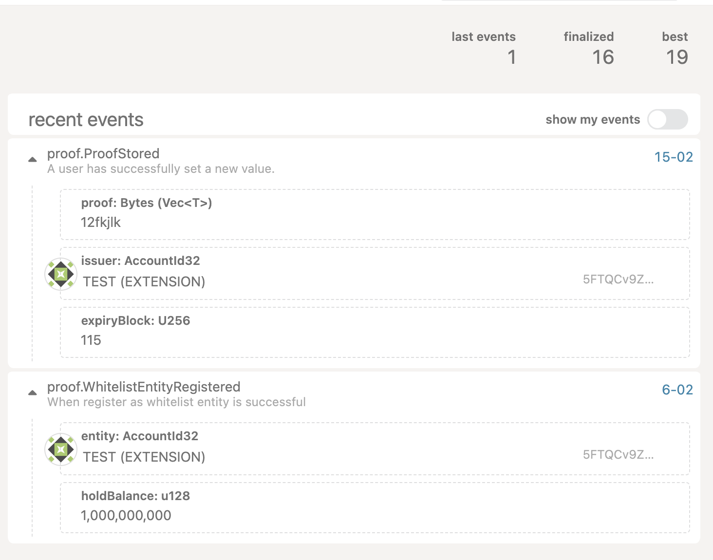

# Probo

Probo is a PoC blockchain for secure, privacy-preserving document verification across borders. The system stores cryptographic proofs instead of raw document data, enabling real-time authentication without exposing sensitive information or requiring centralized authorities.

Please read the [overview](OVERVIEW.md) for the background and justification of the necessity of such blockchain system.

## ProboDapp
ProboDapp is a demo project for the integration with Probo Blockchain.
User can register as whitelisted entity, store signed proof of documents, and verify the documents with signature.
[ProboDapp](https://github.com/yumingchangsabodota/ProboDapp)


## Main Functionalities
- **Register Whitelist Entity**
    - Only registered entities are legitimate for storing proofs
    - In real-world scenarios, we may require entities to register a DID, or we may have a collective where only collective members can include new entity registrations
    - Current requirement for register as legitimate entity is locking certain amount of the native token
- **Store Proof**
    - As this chain is designed to be generic and suit different scenarios, proof generation and verification should be built on the DApp side. The blockchain is mainly for storing and sharing proofs in a trustless way.

## Use the below commands to test and run the node
#### You can find the commands in the `makefile`
```shell
test:
	cargo test -p pallet-issuance-proof -- --nocapture

build:
	cargo build --release

run:
	RUST_BACKTRACE=1 ./target/release/solochain-template-node -ldebug --dev
```

### Demo
